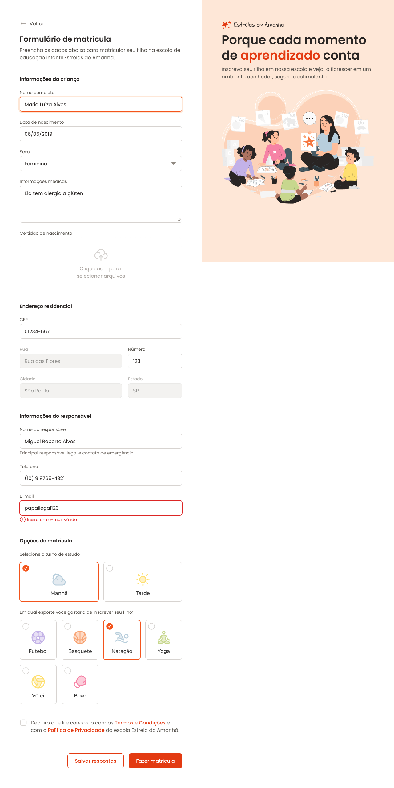

# Enrollment Form

A simple enrollment form, using HTML and CSS.

     <a href="#">📱 Visit this Project</a> 
     <a href="https://www.figma.com/design/OyMxssYrcTerVsuwbXm65z/Formul%C3%A1rio-de-matr%C3%ADcula-(Community)?node-id=3-376&p=f&t=sysKDBvGPAfbWLtk-0">🎨 Figma</a>

    

## Tech Stack

